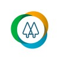

# Wendreo

Working as software developer (or something like that) since 2017, way before the A.I.

---

## Experience

<table>
<tr>
<td width="130" align="center" valign="middle">
   
  <b>Webmotors</b> 
  São Paulo, Brazil
</td>
<td valign="top">
  <b>Software Developer</b> · Jul 2023 – Present  
  
  
  
  
   
  
  
  
  
  
  
</td>
</tr>
</table>

<table>
<tr>
<td width="130" align="center" valign="middle">
   
  <b>Credisan</b> 
  São João da Boa Vista, Brazil
</td>
<td valign="top">
  <b>Software Developer</b> · Mar 2019 – Jul 2023  
  
  
  
  
   
  
  
  
  
  
</td>
</tr>
</table>

---

## Academic Formation

| Degree | Institution | Period |
|---|---|---|
| Graduate Certificate · Database Administration | FAMEF | Jan 2025 – Aug 2025 |
| Graduate Certificate · Cloud Computing | Senac SP | Mar 2022 – May 2023 |
| Graduate Certificate · Mobile Applications Development | IFSP | 2018 – 2019 |
| Technologist Degree · Systems Analysis and Development | UNIFEOB | 2016 – 2018 |

---

## Certifications

<table>
<tr>
<td width="50%" align="left">
   
  <b>C# Certification</b>
</td>
</tr>
</table>

---

