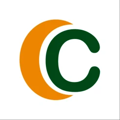

<h1 align="left">Hello! I'm Wendreo F.</h1>

<h2 align="left">
  <p>Working as Software developer (or something like that) since 2017</p>
    <p align="left">
      <a href="https://www.linkedin.com/in/wendreof/">
        
      </a>
      <a href="https://medium.com/@wendreof">
        
      </a>
    </p>
</h2>

<!--START_SECTION:waka-->


**I'm a Night 🦉** 

```text
🌞 Morning                723 commits         ██░░░░░░░░░░░░░░░░░░░░░░░   09.06 % 
🌆 Daytime                871 commits         ███░░░░░░░░░░░░░░░░░░░░░░   10.91 % 
🌃 Evening                4114 commits        █████████████░░░░░░░░░░░░   51.54 % 
🌙 Night                  2274 commits        ███████░░░░░░░░░░░░░░░░░░   28.49 % 
```
📅 **I'm Most Productive on Saturday** 

```text
Monday                   1383 commits        ████░░░░░░░░░░░░░░░░░░░░░   17.33 % 
Tuesday                  1315 commits        ████░░░░░░░░░░░░░░░░░░░░░   16.47 % 
Wednesday                1029 commits        ███░░░░░░░░░░░░░░░░░░░░░░   12.89 % 
Thursday                 1072 commits        ███░░░░░░░░░░░░░░░░░░░░░░   13.43 % 
Friday                   574 commits         ██░░░░░░░░░░░░░░░░░░░░░░░   07.19 % 
Saturday                 2290 commits        ███████░░░░░░░░░░░░░░░░░░   28.69 % 
Sunday                   319 commits         █░░░░░░░░░░░░░░░░░░░░░░░░   04.00 % 
```


📊 **This Week I Spent My Time On** 

```text
🕑︎ Time Zone: America/Sao_Paulo

💬 Programming Languages: 
No Activity Tracked This Week

🔥 Editors: 
No Activity Tracked This Week

💻 Operating System: 
No Activity Tracked This Week
```

**Timeline**


<!--END_SECTION:waka-->

## :briefcase: Most Recent Experiences

[](https://portal.credisan.com.br/)
**.NET Back-End Developer** (Jul 2023 - Present)\
[**WebMotors**](https://www.webmotors.com.br/)<br>
`.NET/C#`, `Microservices`, `AWS`, `Git`, `SQL`, `DevOps`, `Iac`<br>
Featured Projects: Cockpit, Cockpit Wallet
<br><br>

[](https://portal.credisan.com.br/)
**Software Developer - BackEnd & Mobile** (Mar 2019 - Jul 2023)\
[**Credisan Cooperativa de Crédito**](https://portal.credisan.com.br/)<br>
`.NET/C#`, `.NET/VB.NET`, `Flutter`, `Android/iOS`, `SQL`, `Monoliths`, `Microservices` <br>
Featured Projects: [Android App](https://play.google.com/store/apps/details?id=br.com.credisan), [iOS App](https://apps.apple.com/br/app/credisan-pix/id1531922714), [Pix](https://portal.credisan.com.br/pix/), [(DDA) Débito Direto Autorizado](https://portal.credisan.com.br/pix/)
<br><br>

## :notebook_with_decorative_cover: Latest Blog Posts

<!-- BLOG-POST-LIST:START -->
- [Motivos para trocar Newtonsoft.Json por System.Text.Json](https://medium.com/@wendreof/motivos-para-trocar-newtonsoft-json-por-system-text-json-35b2423219f5?source=rss-c5653a56fd0c------2)
- [Automated .NET Code Formatting](https://medium.com/@wendreof/automated-net-code-formatting-5922aa66afd7?source=rss-c5653a56fd0c------2)
- [The Best Fonts for Development](https://blog.devgenius.io/the-best-fonts-for-development-25b15a748409?source=rss-c5653a56fd0c------2)
- [Flutter + Git Hooks](https://blog.devgenius.io/flutter-git-hooks-19d8141176ac?source=rss-c5653a56fd0c------2)
- [Updating Version Code for Play Store Using GitHub Actions](https://blog.devgenius.io/updating-version-code-for-play-store-using-github-actions-d5ea0f07f6ff?source=rss-c5653a56fd0c------2)
<!-- BLOG-POST-LIST:END -->
